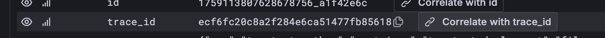
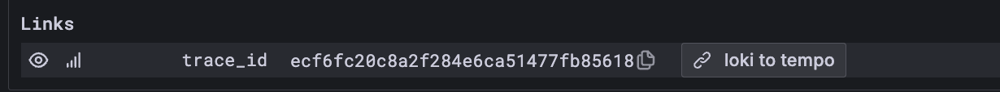
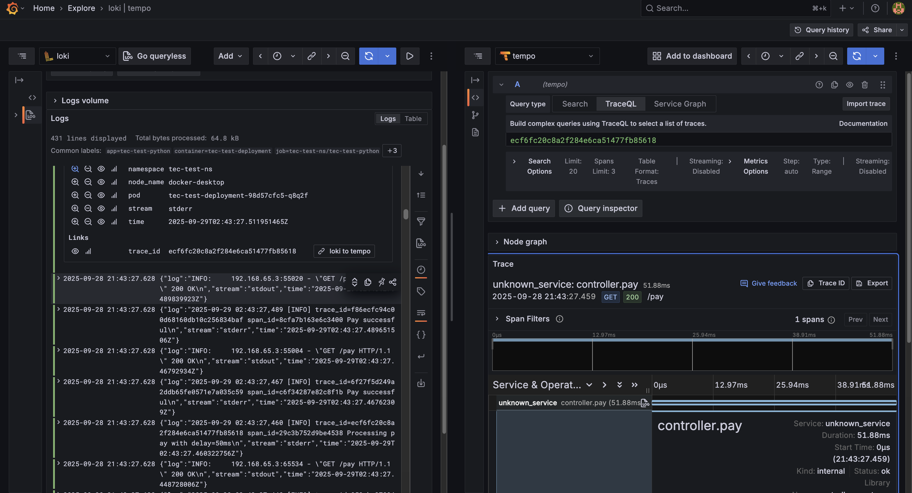

# Technical test SRE

**Clonación de repositorio**
git clone https://github.com/aleon01/technical-test-sre.git

En caso de realizar cambios en la aplciación contruir una nueva versión de la imagen de la aplicación

<pre> docker build -t technical-test:1.0.11 . </pre>

Cambiar la versión de dicha imagen en el deployment de la aplicación.  
Ruta: iac/terraform/modules/app/main.tf
<pre>image = "technical-test:1.0.10"</pre>

**Terraform**
Nos permite inicializar las siguientes aplicaciones a través de Kubernetes - Docker(Desktop)
* Aplicación de pagos
* Prometheus
* Loki
* Tempo
* Open telemetry
* Grafana

Ejecutar los siguientes comandos para terraform
<pre>terraform init # Inicializar terraform
terraform plan # Validar cambios realizados
terraform apply # Aplicar los proveedores, y recursos implicados
terraform destroy -> Eliminar todo lo aplicado </pre> 

En el caso de apply o destroy solicitara aceptar los cambios con un yes.
<pre>Do you want to perform these actions?
  Terraform will perform the actions described above.
  Only 'yes' will be accepted to approve.

  Enter a value: yes</pre>

**Kubernetes**
Al aplicar los cambios con terraform, se podra validar los nodes, deployments, services entre otros. Apartir del namespace **tec-test-ns**

<pre>
kubectl get ns # namespace
kubectl get svc -n tec-test-ns # services
kubectl get deployment -n tec-test-ns
kubectl get pods -n tec-test-ns
kubectl logs -f '< name pod >' -n tec-test-ns
 </pre>

**Rutas**
* Grafana - http://localhost:32030/login #Users (user:admin | pass:admin)
* Prometheus - http://localhost:9090/
* Tempo - http://tempo.tec-test-ns.svc.cluster.local:3200
* Loki - http://loki.tec-test-ns.svc.cluster.local:3100

 

**Grafana**  

**Data sources:** (Para las conecciones se requiere validar los services en kubernetes)
- Add new connection 
    * Prometheus  
        Name: Por defecto  
        Default: false  
        Connection: http://prometheus-operated.tec-test-ns.svc.cluster.local:9090  
    * Loki  
        Name: Por defecto  
        Default: false  
        Connection: http://loki.tec-test-ns.svc.cluster.local:3100  
        Additional settings 
        * Derived fields (Se requiere para filtrar el traceId para la correlación tempo - loki) 
            Name: trace_id 
            Regex: trace_id=([a-f0-9]+) 
            URL: \${__tempo_link:tempo:trace/${trace_id}} 
    * Tempo  
        Name: Por defecto  
        Default: true  
        Connection: http://tempo.tec-test-ns.svc.cluster.local:3200  
        Trace to logs: 
        * Data source: loki 
        * Filter by trace ID: True 
        * Node graph: True 

**Correlación:** (A través de Explore) 
* Data source: Loki
* Expresión: {namespace="tec-test-ns", app="tec-test-python"} | json
* Seleccionar un log con traceId
* Seleccionar Add - Add correlation
* Seleccionar Correlate with trace_id

* En la pantalla que sale
    - Confirmar que el data source sea tempo 
    - Tomar la variable de la lista que da, /${trace_id} 
    - Ingresar la variable en el campo de la expresión  
        <pre>Build complex queries using TraceQL to select a list of traces.</pre> 
    - Seleccionar Save
* Al ver nuevamente el log, se visualizara la sección de links

**Finalmente me muestra la correlación**

